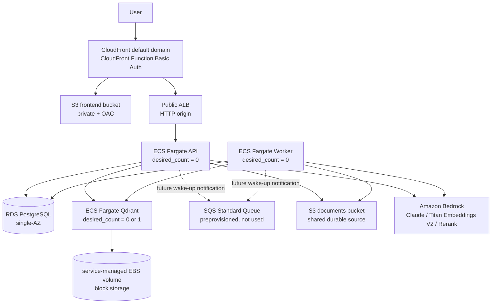

# RAGProject AWS ECS Fargate demo

このディレクトリは、RAGProjectをAWS ECS Fargate上で動かすdemo stackです。アプリはBedrock generation、Titan Embeddings V2、Bedrock Rerank、S3 document storageに対応済みです。認証不要CIでは `terraform fmt`、`init -backend=false`、`validate` だけを実行し、このPRでは実AWSの `terraform plan` / `apply` は実行しません。

## 1. 全体アーキテクチャ



Frontend は Vite/React の build artifact を S3 に置き、CloudFront OAC だけで読める private bucket とします。API は CloudFront の `/api/*`、`/health`、`/ready` から ALB HTTP origin に流します。ALB 自体は public ですが、security group は CloudFront origin-facing managed prefix list からの HTTP のみに絞ります。

### Graph backend policy

ECS 版のグラフバックエンドは `GRAPH_STORE_PROVIDER=postgres` とし、RDS PostgreSQL 上のグラフテーブルを使います。この ECS stack には Neo4j コンテナや Neo4j 用インフラは含めません。Neo4j は EKS 本番 HA 版で StatefulSet と永続ボリュームを使う read model / projection として扱う予定で、source of truth は引き続き Postgres です。

Amazon Neptune はこの demo stack では採用しません。Neptune openCypher は Neo4j Cypher と完全互換ではなく、APOC や CONSTRAINT など Neo4j 前提のクエリ・運用を使うにはアプリ側の移植が必要です。また完全な scale-to-zero ができず、短時間 demo の固定費に合いません。将来 managed graph DB を見せる場合は、既存 Neo4j provider の置き換えではなく `NeptuneGraphStore` のような別 provider として検討します。

## 2. モジュール構成の理由

| module | 責務 | 理由 |
|---|---|---|
| `network` | VPC、public subnet、IGW、route table、SG | NAT なし構成の境界と通信制御を一箇所で確認できる |
| `alb` | ALB、target group、listener | ECS service と CloudFront origin から独立してレビューできる |
| `ecr` | API/worker ECR repository、lifecycle | image retention と push 先を明確化する |
| `ecs` | cluster、task definition、service、Cloud Map | compute と service discovery をまとめ、desired count を一元管理する |
| `rds` | PostgreSQL、subnet group、SG attachment | DB の single-AZ/小構成を明示する |
| `sqs` | Standard queue、DLQ、redrive | 将来のwake-up通知用。現行job state/leaseはPostgreSQLがsource of truth |
| `s3` | documents/frontend buckets、暗号化、versioning、public block | bucket security baseline を再利用しやすくする |
| `cloudfront` | distribution、OAC、Basic Auth Function | edge 配信と認証 gate を分離する |
| `iam` | GitHub OIDC、ECS roles、Bedrock/S3/Secrets 権限 | trust boundary と least privilege をレビューしやすくする |
| `observability` | CloudWatch log groups | retention を短くし、ログコストを見える化する |
| `budget` | AWS Budgets、SNS topic、email subscription | コスト guardrail を infrastructure と同時に用意する |

root module は各 module をつなぐ orchestration だけを持ちます。例外として、frontend bucket policy は S3 bucket と CloudFront distribution ARN の両方に依存するため、cycle を避ける目的で root に置いています。

## 3. ECS Fargate + scale-to-zero にした理由

Fargate は EC2 worker node の OS patch、capacity 管理、AMI 更新を持たないため、デモ環境の運用負担を下げられます。API、worker、Qdrant は `desired_count = 0` を default にしており、普段は task 課金を止めます。

必要なときだけ `api_desired_count = 1`、`qdrant_desired_count = 1` のように増やす想定です。Qdrant の `/qdrant/storage` は NFS/EFS ではなく、ECS service-managed EBS の `gp3` block storage を mount します。これは Qdrant の storage 要件に合わせるためです。ただし ECS service が管理する EBS volume は task replacement や scale-to-zero で削除されるため、Qdrant collection は永続的な source of truth ではありません。task 置換、scale-to-zero 後の再起動、Bedrock adapter 有効化後は source documents から再indexしてください。

`worker_desired_count` の既定値はscale-to-zeroのため `0` です。document upload/indexingを行う時間だけ `1` に上げられます。APIとworkerは同じS3 objectを参照し、job state/lease/retryは既存PostgreSQL job tableを使います。

## 4. NAT Gateway を使わない理由と tradeoff

この雛形では NAT Gateway を作りません。Fargate task は public subnet に置き、`assign_public_ip = true` にして ECR、CloudWatch Logs、Secrets Manager、Bedrock へ直接 egress します。NAT Gateway は idle な demo 環境でも月額固定費が目立つため、先行雛形では外しています。

tradeoff は次のとおりです。

- task に public IP が付きます。ただし inbound は security group で閉じ、API は ALB 経由、Qdrant/RDS は内部 SG 参照だけに制限します。
- private subnet + NAT/VPC endpoints よりも network isolation は弱いです。本番化フェーズでは private subnet、VPC endpoints、WAF、Route53/ACM を追加する余地があります。
- RDS は `publicly_accessible = false` で public IP を持たせず、SG は ECS app SG からの 5432 のみ許可します。DB subnet group は小構成のため public subnets を使います。

## 5. Terraform state を S3 + DynamoDB にする理由

remote state は複数人・CI での差分確認や将来の apply に必要です。S3 は versioning と暗号化を有効化し、DynamoDB は state lock 用に `LockID` hash key を持ちます。

state backend 自体は Terraform state の保存先なので、root module から同時に作れません。そのため `bootstrap/` を local backend の最小構成として分離しています。

手順:

```bash
cd deploy/aws-ecs/bootstrap
terraform init
terraform fmt -check -recursive
terraform validate
# 初回構築時だけ、人間が内容を確認してから:
# terraform apply
```

bootstrap の outputs を root `backend.tf` に反映、または `-backend-config` で渡してから root を初期化します。

```bash
cd deploy/aws-ecs
terraform init -reconfigure
terraform fmt -check -recursive
terraform validate
# アプリ完成後、認証情報とコスト承認がある場合だけ:
# terraform plan
# terraform apply
```

この PR では認証情報もコスト承認もないため、`terraform init -backend=false` と `terraform validate` までに止めます。

## 6. GitHub OIDC を使う理由

GitHub Actions 用の deploy role は OIDC trust で `repo:owner/repo:ref:refs/heads/<branch>` に限定します。長期の AWS access key を GitHub Secrets に置かず、短期 STS credential だけで ECR push / ECS deploy を行う設計です。

この role は Terraform 全権限 role ではなく、雛形では image push と ECS service 更新に絞っています。将来 Terraform apply を CI から行う場合は、別 role と承認 gate を設計してください。

## 7. Bedrock keyless 設計

Claude、Titan Text Embeddings V2、Rerank は API key を持たず、ECS task role の IAM 権限で呼び出す前提です。`iam` module は次の action/resource に限定します。

- `bedrock:InvokeModel`: `bedrock_generation_model_id`、`bedrock_embedding_model_id`、`bedrock_rerank_model_id`
- `bedrock:Rerank`: AWS rerank prerequisites に合わせて resource は `*`
- `secretsmanager:GetSecretValue`: 指定された Secret ARN のみ
- `ssm:GetParameter(s)`: 指定された Parameter ARN のみ
- S3 documents bucket と SQS job queue の必要操作のみ

現在のアプリ側 provider enum には `bedrock` がまだ無いため、ECS env の default は `GENERATION_PROVIDER=fake`、`EMBEDDING_PROVIDER=fake`、`RERANK_PROVIDER=none` にしています。Bedrock adapter 実装後に provider env を切り替える想定です。

## 8. コンポーネント別の利点・コスト・retention

| component | 利点 | demo cost 方針 |
|---|---|---|
| CloudFront | default domain で ACM/Route53 なしに HTTPS 配信できる | traffic 少量なら低額。Basic Auth Function は軽量 |
| S3 frontend | 静的 asset を private bucket + OAC で配信 | storage/requests 分のみ。versioning は rollback 用 |
| ALB | ECS API の health check と target group を提供 | desired_count 0 でも ALB 固定費は残る |
| ECS API/worker/Qdrant | server 管理なし、desired count で起動停止しやすい | default 0 で task 課金を止める |
| ECR | image scan と lifecycle で最小限保持 | default 最新 10 images のみ保持 |
| RDS PostgreSQL | source of truth。managed password で平文 secret 不要 | single-AZ、`db.t4g.micro`、backup 1 day |
| Qdrant + EBS | Qdrant 要件に合う block storage を task に attach | Qdrant task は 0/1、EBS volume は task 稼働中に service-managed で作成され、停止/置換時は再index前提 |
| SQS + DLQ | worker retry と失敗隔離 | request 数に応じた従量課金 |
| S3 documents | source documents の private storage | AES256、versioning enabled |
| CloudWatch Logs | task log の集約 | retention default 7 days |
| AWS Budgets + SNS | 月次 guardrail | Budget 自体は低コスト。email subscription は要承認 |
| Bedrock | keyless IAM 呼び出し | model invocation 分のみ。adapter 実装後に有効化 |

## 9. パラメータ化した箇所

- `api_image_tag` / `worker_image_tag`: image build/push 後に差し替えます。
- `database_url_secret_arn` / `session_secret_arn`: secret 値は Terraform に入れず、Secrets Manager ARN だけ渡します。
- `additional_secret_arns` / `ssm_parameter_arns`: 将来の provider token や設定値を ARN で追加できます。
- `bedrock_generation_model_id` / `bedrock_embedding_model_id` / `bedrock_rerank_model_id`: Bedrock model 切替に対応します。
- `graph_store_provider`: ECS 版は `postgres` を default とし、API/worker の `GRAPH_STORE_PROVIDER` に渡します。Neo4j 切替は EKS 版で扱います。
- `basic_auth_header_sha256`: plaintext password ではなく、期待する `Authorization` header 全体の SHA-256 hex を渡します。
- desired count: API/worker/Qdrant を demo 時だけ起動するために変数化しています。
- log retention / ECR retention / budget amount: demo cost に合わせて調整します。

Titan Text Embeddings V2 は既存 local embedding と vector dimension が異なる可能性があります。`QDRANT_COLLECTION_NAME` は `document_chunks_bedrock_titan_v2` を default にして混在を避けていますが、adapter 実装後に実 dimension を確認し、既存 Qdrant collection は re-index してください。

## 10. 実行手順と merge 戦略

この PR で行うこと:

```bash
cd deploy/aws-ecs
terraform init -backend=false
terraform fmt -check -recursive
terraform validate

cd bootstrap
terraform init -backend=false
terraform validate
```

この PR で行わないこと:

- `terraform plan`
- `terraform apply`
- 実 AWS resource 作成
- secret 値の投入
- app code の Bedrock adapter 実装

初回 apply 前の注意:

- `database_url_secret_arn` と `session_secret_arn` は、Secret 自体を事前に作成して ARN を渡します。
- `DATABASE_URL` の secret value は RDS endpoint、DB name、user、password が確定してから人間が投入します。RDS master password は `manage_master_user_password = true` で RDS-managed secret に置かれ、Terraform files には入りません。
- `terraform.tfvars.example` の ARN と hash は placeholder です。実 secret 値や実 account id は commit しません。

merge 戦略:

1. この PR は Draft として Terraform 雛形をレビューします。
2. sandbox accountでS3 upload→PostgreSQL job lease→worker ingest→Bedrock/Qdrant検索のlive smokeを実施します。SQSは必要時だけwake-up通知として追加します。
3. bootstrap を人間が承認して初回 apply し、remote state backend を確定します。
4. root stack の plan をレビューし、コスト・IAM・network を再確認してから初回 apply します。

## 11. PR #88 review follow-up

この追補はアプリコードを変更せず、Terraform 側で PR #88 の review 指摘を扱うための運用前提です。

### CloudFront to ALB origin binding

CloudFront は ALB origin へ `origin_verify_header_name` / `origin_verify_header_value` を送ります。ALB listener は default `403` とし、この秘密 header が一致した場合だけ API target group へ forward します。ALB security group の CloudFront origin-facing managed prefix list はネットワーク層の絞り込みとして残しますが、この秘密 header が「この CloudFront distribution からの origin request」に束縛する制御です。

`origin_verify_header_value` は Terraform file に実値を commit せず、外部で生成したランダム値を入力してください。CloudFront と ALB listener rule の双方が apply 時に参照するため sensitive variable として扱います。

### CSRF public origin

backend の CSRF 検証は `CORS_ALLOWED_ORIGINS` を許可 origin として使います。ECS task では public HTTPS origin をこの env に設定します。default ではこの stack の CloudFront default domain を使い、custom domain や段階 rollout では `app_public_origin` を指定します。

```hcl
app_public_origin = "https://d111111abcdef8.cloudfront.net"
```

### Document storage / worker ingestion

アプリは `STORAGE_BACKEND=s3`、`DOCUMENTS_BUCKET_NAME`、`DOCUMENTS_KEY_PREFIX` を使い、APIとworkerで同じprivate S3 objectを参照します。upload時はS3 write後にPostgreSQLへjobをcommitし、DB flow失敗時はS3 objectをbest-effort削除します。workerはS3 objectを上限付き一時ファイルへmaterializeし、extract後に削除します。

非AWS環境の既定は引き続き `STORAGE_BACKEND=local` です。S3 clientは静的access keyを設定せず、AWS SDK default credential chainからECS task roleを使います。

job queueはSQSへ置き換えません。PostgreSQL job tableのlease/retry/statusがsource of truthです。SQS/DLQは将来のwake-up通知用に未接続で、task roleにも現時点ではSQS権限を付与しません。

### CloudFront to ALB TLS deferral

この demo skeleton では CloudFront to public ALB origin は引き続き `origin_protocol_policy = "http-only"` です。ALB 側で HTTPS origin にするには、CloudFront origin hostname と一致する ACM certificate が必要です。現状は CloudFront default domain と生成 ALB DNS name を使う雛形であり、Route53/custom domain 所有を前提にしないため、この PR では CloudFront to ALB 間 TLS は意図的に defer します。

残存リスク: session、CSRF、Basic Auth header が CloudFront to ALB の public origin hop では HTTP になります。秘密 origin header と CloudFront prefix-list SG は origin bypass を抑制しますが、この hop の暗号化にはなりません。

prod/EKS phase 対応: custom origin hostname + ALB ACM certificate を用意して `origin_protocol_policy = "https-only"` にするか、CloudFront VPC origin / internal ALB へ移行します。

### Migration task

新規 RDS では API を scale out する前に one-off ECS task を実行し、schema migration 後に `--skip-document-indexing` 付き seed でログインユーザー、システム設定、seed DB rows を作成します。

```bash
terraform output -json public_subnet_ids
terraform output app_security_group_id
terraform output migration_task_definition_arn

aws ecs run-task \
  --cluster "$(terraform output -raw ecs_cluster_name)" \
  --launch-type FARGATE \
  --task-definition "$(terraform output -raw migration_task_definition_arn)" \
  --network-configuration "awsvpcConfiguration={subnets=[subnet-REPLACE,subnet-REPLACE],securityGroups=[$(terraform output -raw app_security_group_id)],assignPublicIp=ENABLED}"
```

task command:

```bash
sh -c 'alembic upgrade head && APP_ENV=local python -m app.scripts.seed --skip-document-indexing'
```

seed の `APP_ENV=local` は seed CLI の安全ガードを通すため、この command の seed 実行だけに限定します。`--skip-document-indexing` により Qdrant への document indexing は実行しないため、Bedrock adapter 未実装または fake provider のままでも `document_chunks_bedrock_titan_v2` に fake vector は入りません。Bedrock Titan V2 を有効化した後、document indexing だけを別途実行してください。

成功後に `api_desired_count` と `qdrant_desired_count` を必要数へ変更して再 apply します。`worker_desired_count` はdocument indexingを行う間だけ増やし、処理後はscale-to-zeroへ戻してください。ECS service は `desired_count` を ignore しないため、変数変更が反映されます。

### Existing GitHub OIDC provider

AWS account に `token.actions.githubusercontent.com` provider が既にある場合は重複作成を避けます。

```hcl
create_github_oidc_provider = false
# github_oidc_provider_arn = "arn:...:oidc-provider/token.actions.githubusercontent.com"
```

`github_oidc_provider_arn` 未指定かつ作成無効の場合、IAM trust policy は現在の AWS account から導出した標準 provider ARN を使います。

### Embedding demo defaults

ECS demo は Bedrock adapter 有効化前の安全側 default として `EMBEDDING_PROVIDER=fake` を維持しますが、`EMBEDDING_VECTOR_DIMENSION` と `EMBEDDING_FAKE_DIMENSION` はどちらも `1024` にします。fake embedding は CI/ローカル用途の default であり、本番 document indexing は Bedrock Titan V2 を有効化した後に実行してください。これにより fake provider を使う検証時も `document_chunks_bedrock_titan_v2` の vector dimension は Titan V2 想定と揃いますが、fake vector 自体を本番データとして扱うことは避けます。
