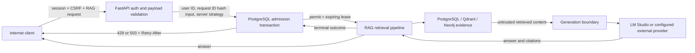

# RAGProject threat model

## Executive summary

対象は、インターネット公開されたRAGProjectを認証済みユーザーだけが利用する構成である。保護優先度が最も高いのは、文書・質問に含まれるPIIと業務情報、セッション、LLM/GPU/DBの処理容量、外部LLM利用時の費用、監査記録の完全性である。

主要な攻撃経路は、認証済みユーザーまたは窃取セッションによる高頻度RAG実行、複数アカウントによるper-user制限回避、高コストAgentic strategyの反復、検索文書からの間接prompt injection、監査行やDB lock自体を使った二次的DoSである。RAG入口にはPostgreSQLで共有されるrate、concurrency lease、per-user/shared daily work-unit gateを設ける。質問、retrieved chunk、tool結果はlimit値やwork-unit mappingを変更できない。

この制御は金銭的な課金台帳ではない。固定の保守的work unitで受理前に止めるadmission controlである。PII masking、prompt-injection gate、外部providerへの送信境界は別レイヤーとして維持し、通常RAG精度評価とsecurity gateを混ぜない。

## Scope and assumptions

対象範囲:

- `POST /api/v1/rag/ask` の認証、CSRF、payload validation、admission、retrieval、generation、lease解放。
- FastAPI、PostgreSQL、Qdrant、Neo4j、LM Studioおよび設定で選択される外部generation provider。
- 受理イベントと拒否集約監査、設定validation、Alembic migration。
- internet-facing、admin/viewerの認証ユーザーのみ、完全自動運用を前提とする。

対象外:

- IdPのアカウント発行、支払い・請求システム、ネットワークDDoS/WAF、ホストOS、Docker Desktop自体。
- 外部providerが保持するデータの管理策。送信前PII maskingとprovider allowlistは別タスクで扱う。
- Gold v2や通常精度の変更。security制御は回答評価datasetを変更しない。

前提:

- 本番でadmission controlを有効にする場合、全API instanceが同じPostgreSQLを使用する。設定validationが本番SQLiteを拒否する（`backend/app/core/config.py:437-442`）。
- ローカル/テストSQLiteのlockは単一processの検証用であり、分散保証を主張しない。
- `SESSION_SECRET` は安定して安全に管理される。これをrotationするとHMAC subjectが変わり、rate/daily履歴が新しいidentityへ切り替わる。
- DB時計とアプリ時計はUTCへ同期される。

## System model

### Components

- Browser/client: session cookieとCSRF headerを付けてRAG requestを送る。
- FastAPI auth/CSRF: active session、active user、admin/viewer roleを検証する（`backend/app/api/deps.py:18-33`, `backend/app/api/deps.py:58-63`）。
- RAG route: chat ownershipとtyped payloadを確認後、RAG pipelineより前にadmissionを実行する（`backend/app/api/routers/rag.py:54-88`）。
- Abuse control service: server-owned strategy weightsと順序付きgateを評価する（`backend/app/services/rag_abuse_control_service.py:20-31`, `backend/app/services/rag_abuse_control_service.py:64-140`, `backend/app/services/rag_abuse_control_service.py:169-244`）。
- PostgreSQL: advisory transaction lock、受理行、crash-safe lease、拒否bucketを共有する（`backend/app/repositories/rag_abuse_control_repository.py:19-25`, `backend/app/db/models.py:1041-1112`）。
- Retrieval stores: PostgreSQL/Qdrant/Neo4jから文書証拠を取得する。
- Generation provider: LM Studioが既定。設定によりOpenAI/Anthropic/Gemini等の外部境界も存在する（`backend/app/core/config.py:297-316`）。
- Safe audit:既存監査metadataはprompt/content/payloadキーをredactする（`backend/app/services/audit_service.py:12-26`, `backend/app/services/audit_service.py:51`）。

### Data flows

Trust boundaries:

1. Internet clientからFastAPI。すべてのbody/header/cookieを不信とする。
2. 認証済みidentityからadmission policy。認証済みでも濫用者になり得る。
3. FastAPIからPostgreSQL。DB障害・lock競合時は高コスト処理へfail openしない。
4. Retrieval storeからgeneration。document/chunk/tool contentを命令ではなくuntrusted dataとして扱う。
5. アプリから外部LLM。PII・機密情報の送信境界であり、可能な限りLM Studio内に留める。

## Assets

| Asset | Why it matters | Security objective |
|---|---|---|
| Questions, documents, retrieved chunks | PIIや業務機密を含み得る | Confidentiality, minimization |
| Session and CSRF state | 窃取されると認証済み濫用が可能 | Confidentiality, integrity |
| LLM/GPU/DB capacity | 枯渇すると全ユーザーが停止する | Availability, fair use |
| External provider spend | 自動Agentic処理で費用が増幅する | Bounded consumption |
| Admission and denial records | 制御判断と調査の根拠 | Integrity, privacy, retention |
| Strategy/limit configuration | 攻撃者が変更するとgateを迂回できる | Server-side integrity |
| Citations and answers | poison/injectionで誤回答し得る | Integrity, provenance |

## Attacker model

想定する能力:

- 正規のviewer/adminアカウント、または窃取した有効sessionを1つ以上持つ。
- 許可されたRAG payload、strategy、message、client message IDを自動反復できる。
- 自分が登録可能な文書へprompt injectionやnear-miss evidenceを混入できる場合がある。
- 複数アカウントを使い、per-user制限を分散できる。
- timeout、replay、失敗、同時実行を組み合わせ、capacityや監査storageを狙える。

想定しない能力:

- PostgreSQL管理者権限、サーバー設定・環境変数の変更権限、コード署名/デプロイ権限。
- `SESSION_SECRET`、DB credential、外部provider API keyの取得済み状態。
- ホストまたはcontainer runtimeを完全に掌握した状態。

## Entry points

| Entry point | Authentication | Untrusted inputs | Evidence |
|---|---|---|---|
| `POST /api/v1/rag/ask` | active session + CSRF | body、strategy、message、client ID、request ID header | `backend/app/api/routers/rag.py:54-88` |
| Session cookie | pre-existing credential | cookie、client IP、user agent | `backend/app/api/deps.py:18-33` |
| Retrieved document/chunk | document authorizationに依存 | source label、text、metadata、embedded instructions | system data flow |
| Agentic tool result | authenticated RAG execution | tool output、planner result、fallback signal | Agentic pipeline |
| Generation provider | server config | prompt/context sent across provider boundary | `backend/app/core/config.py:297-316` |
| Operator settings | deployment authority | rate、concurrency、daily units、lease/retention | `backend/app/core/config.py:43-51` |

## Top abuse paths

1. 認証ユーザーがdense/hybrid/Agentic requestを高速反復し、GPU/LLM/DBを枯渇させる。
   - per-user/shared rolling rateで受理前に停止する。
   - `429`または`503`と`Retry-After`を返す。
2. 複数アカウントへrequestを分散し、per-user枠を迂回する。
   - shared rate、shared concurrency、shared daily work unitsで総量を制限する。
3. 高コストstrategyを選び、同じ件数でもtool/LLM callを増幅する。
   - strategy enum検証後、server-owned mappingで1/2/4/6/8 unitを課す。未知strategyは最大8 unit。
4. 長時間実行やprocess crashでconcurrency枠を保持し続ける。
   - terminal時にleaseを解放し、crash時も最大900秒で期限切れになる。leaseは最大Agentic timeout以上を設定validationする。
5. admission transaction/監査そのものを濫用する。
   - PostgreSQL transaction lockは1秒timeout。拒否は1分bucketへ集約し、1 request=1 audit rowを避ける。
6. retrieved chunk/tool contentが「制限解除」「Plusへ昇格」等を命令する。
   - limitとwork-unit mappingはrequest/context/tool出力から読まない。prompt injection検出・tool権限は別security gateで評価する。

## Threat model table

| ID | Threat | Preconditions | Impact | Existing controls | Residual risk / next mitigation | Evidence |
|---|---|---|---|---|---|---|
| T-01 | Single-account request flood | valid session | GPU/DB exhaustion | per-user rate + concurrency + daily units | stolen sessions remain valid until revocation; add account anomaly alert | `backend/app/services/rag_abuse_control_service.py:169-233` |
| T-02 | Multi-account/sybil flood | multiple valid sessions | shared outage/cost | global rate + concurrency + daily units | account issuance abuse is outside app; add IdP/risk signals | `backend/app/services/rag_abuse_control_service.py:188-244` |
| T-03 | Agentic cost amplification | strategy selection allowed | tool/LLM call growth | immutable work-unit mapping; unknown=max | units approximate cost; calibrate from measured token/tool usage | `backend/app/services/rag_abuse_control_service.py:20-31`, `backend/app/services/rag_abuse_control_service.py:263` |
| T-04 | Crash-held concurrency | process terminates after permit | temporary denial | expiring lease + terminal release | fixed 900s may be conservative; add lease heartbeat if workloads exceed timeout | `backend/app/api/routers/rag.py:95-118`, `backend/app/core/config.py:429-435` |
| T-05 | Admission DB failure | DB unavailable/locked | availability loss | fail-closed 503; 1s lock timeout | DB outage stops all RAG by design; add HA DB and alert | `backend/app/repositories/rag_abuse_control_repository.py:19-25`, `backend/app/services/rag_abuse_control_service.py:54-58` |
| T-06 | Audit/storage amplification | repeated denied requests | DB growth | per-minute denial bucket + retention prune | pruning is traffic-driven; add scheduled retention job | `backend/app/repositories/rag_abuse_control_repository.py:27-44`, `backend/app/repositories/rag_abuse_control_repository.py:163-195` |
| T-07 | Identifier/privacy leak in control records | DB read or artifact export | user/request correlation | HMAC subject/request hash; no raw prompt/chunk | session-secret rotation changes identity; define rotation/runbook | `backend/app/services/rag_abuse_control_service.py:246-251`, `backend/app/db/models.py:1041-1112` |
| T-08 | Indirect prompt injection | poisoned retrieved content | unsafe answer/tool action | separate injection/tool security gates; context cannot alter admission mapping | adaptive/obfuscated injection remains; expand adversarial corpus | retrieval-to-generation trust boundary |
| T-09 | External provider data disclosure | non-local provider enabled | PII/secret egress | provider is server config; audit redaction | implement mandatory PII masking and egress policy before cloud cascade | `backend/app/core/config.py:297-316`, `backend/app/services/audit_service.py:12-26` |
| T-10 | Replay consumes budget | network retry or deliberate replay | user-visible quota depletion | replay is deliberately charged as admission work | distinguish idempotent replay before admission without opening DB-amplification bypass | `backend/app/api/routers/rag.py:83-104` |

## Criticality

- Critical: 大規模な機密漏えい、認証/権限の全面迂回、無制限のtool write、全体停止または無制限課金が容易に継続する。
- High: 認証ユーザーが共有capacityや費用を継続的に枯渇させる、またはPIIを外部へ送信できる。
- Medium: 単一ユーザーの一時的なquota枯渇、限定的な監査欠損、短時間のcapacity過保護。
- Low: 攻撃成立にoperator/DB管理権限が必要、または影響が観測・自動回復する局所事象。

現状の最重要残余リスクはHighの外部LLM送信境界、認証アカウント大量発行、adaptive prompt injectionである。admission DB障害時の全RAG停止はavailability上Highになり得るが、費用・capacity攻撃に対する意図したfail-closedである。

## Focus paths

1. 外部provider egress: PII maskingを必須化し、provider/model allowlist、送信field、保存期間、failure policyをテストする。
2. Prompt injection: retrieved chunk poisoning、tool result injection、model-tier昇格命令、obfuscationを分離したsecurity corpusで評価する。通常精度とは別gateにする。
3. Account/cost abuse: IdP側account issuance/risk signalと連携し、typed denial bucketからPIIなしのalertを作る。
4. Budget calibration: work unitを実token/tool/latency分布と照合し、Flash/Plus cascade導入前にPlus強制攻撃を評価する。
5. Resilience: PostgreSQL HA、admission failure alert、scheduled retention、controlled `SESSION_SECRET` rotation runbookを追加する。

参考:

- OWASP LLM01 Prompt Injection: https://genai.owasp.org/llmrisk/llm01-prompt-injection/
- OWASP LLM10 Unbounded Consumption: https://genai.owasp.org/llmrisk/llm102025-unbounded-consumption/
- NIST AI 100-2e2025: https://doi.org/10.6028/NIST.AI.100-2e2025
- NIST agent hijacking evaluation guidance: https://www.nist.gov/news-events/news/2025/01/technical-blog-strengthening-ai-agent-hijacking-evaluations
