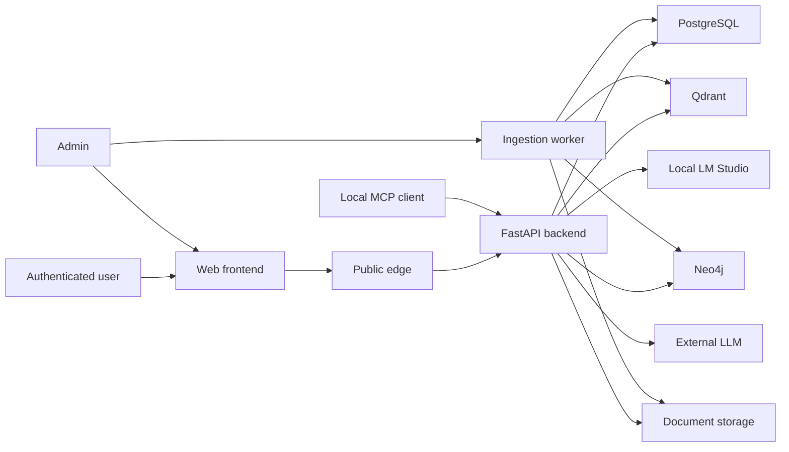

# RAGProject threat model

最終更新: 2026-07-29

## Executive summary

最大のリスクは、認証済み利用者の質問や取得文書に含まれるPII・機密情報を、
外部LLMへ意図せず送ること、取得chunkの間接prompt injection、FlashからPlusへの
自動昇格を悪用したコスト／可用性攻撃である。現在はsession認証、role、CSRF、
upload上限、SSRF対策、Agentic budget、trace redactionを備える一方、外部生成payloadの
PII masking、`/rag/ask`のユーザー別quota、server-side provider policy、poisoned chunkの
quarantineは未実装である。公開前にこれらをfail-closedで追加し、通常精度とは別の
RAG-31 security gateで検証する。

## Scope and assumptions

- In scope:
  - `backend/app/api`
  - `backend/app/core`
  - `backend/app/rag`
  - `backend/app/services`
  - `backend/app/mcp`
  - `frontend/src`
  - `deploy/aws-ecs`
- ユーザー確認済み前提:
  - インターネットへ公開するが、RAG利用は認証済みユーザーに限定する
  - 文書と質問にPIIが含まれ得る
  - 外部送信は可能な限り避け、必要時も送信前にPIIをmaskする
  - 将来のFlashからPlusへの昇格は完全自動で行う
- 仮定:
  - 現時点は単一組織の共有corpusである。multi-tenant化する場合、document/chunk単位の
    tenant authorizationが追加されるまで公開しない
  - 公開経路はCloudFrontまたは同等のHTTPS reverse proxyを使用する
  - LM Studioは同一管理境界内、Alibaba Model Studio等は外部管理境界として扱う
- Out of scope:
  - ローカル専用の評価runの精度昇格判断
  - GitHub Actions自体の詳細監査
  - OS、Docker Desktop、LM Studio本体の脆弱性監査
- Risk rankingを変えるopen question:
  - 将来multi-tenantにするか
  - 対象PIIに要配慮個人情報、決済情報、医療情報が含まれるか
  - 外部providerの保存期間、学習利用、data residency契約

## System model

### Primary components

- React frontend: login、document管理、RAG質問、admin操作。
- FastAPI backend: session認証、CSRF、role判定、RAG orchestration、provider選択。
  Evidence: `backend/app/main.py`, `backend/app/api/deps.py`,
  `backend/app/api/routers/rag.py`.
- Ingestion worker: upload／URL文書の抽出、chunking、embedding、graph抽出。
  Evidence: `backend/app/api/routers/documents.py`,
  `backend/app/services/document_service.py`.
- Data stores: PostgreSQL、Qdrant、Neo4j、upload storage。
- Model boundary: local LM Studioと、設定時のみ外部generation provider。
  Evidence: `backend/app/rag/generation.py`,
  `backend/app/services/rag_service.py`.
- Public deployment: CloudFront、ALB、ECS、RDS、Secrets Manager。
  Evidence: `deploy/aws-ecs/main.tf`, `deploy/aws-ecs/modules/cloudfront/main.tf`,
  `deploy/aws-ecs/modules/network/main.tf`.

### Data flows and trust boundaries

- Internet -> CloudFront／frontend: credentials、session cookie、質問、回答。HTTPSを前提とし、
  backendはproductionでsecure cookieとstrong session secretを要求する。
- Browser -> FastAPI: JSON、multipart upload、CSRF header。session認証、role、CSRF、
  Pydantic schema、upload byte上限を適用する。
- FastAPI／worker -> PostgreSQL／Qdrant／Neo4j／storage: user、document、chunk、graph、
  retrieval trace。アプリnetwork内に限定するが、文書PIIは平文dataとして扱う。
- FastAPI -> LM Studio: user message、取得chunk、system instruction。ローカル管理境界内。
- FastAPI -> external LLM: user message、取得chunk、system instruction、provider credential。
  現在はraw generation inputを組み立てるが、送信前PII gateはない。
- Admin -> URL fetcher: external URL。scheme、credential、DNS解決先、private／metadata IP、
  redirect、content type、sizeを検査する。
- Local MCP client -> MCP HTTP／stdio: read-mostly tools。HTTPはBearer、local-only、
  write無効を設定validatorが要求する。

#### Diagram

## Assets and security objectives

| Asset | Why it matters | Security objective |
|---|---|---|
| User questions and chat history | PII、業務情報、意図を含み得る | C/I |
| Uploaded and fetched documents | corpus、PII、知財の原本 | C/I/A |
| Retrieved context and graph | 複数文書由来の情報を集約する | C/I |
| Session／CSRF／provider credentials | account、外部課金、data accessを保護する | C/I |
| Provider routing and cascade policy | 外部送信先、精度、コストを決める | I/A |
| Audit and evaluation evidence | incident調査、昇格判断、公開主張に使う | I/A |
| GPU、LLM quota、worker capacity | RAGの可用性と費用に直結する | A |

## Attacker model

### Capabilities

- 有効なviewer accountを持ち、質問、strategy、許可されたmodel keyを繰り返し送る。
- 文書内に含まれる間接prompt injectionを質問で誘発する。
- admin accountを奪取した場合、upload、URL ingest、approvalを悪用する。
- 公開login、CSRF token発行、health endpointへ到達する。
- 応答時間、status、safe reason codeから限定的な挙動を観測する。

### Non-capabilities

- 通常のviewerはdocument upload、URL ingest、raw retrieval debug、admin設定を行えない。
- 現在のMCPはremote公開、write tool、evaluation run作成を設定validatorが拒否する。
- attackerがhost、DB、LM Studio、AWS accountへ直接ログインできるとは仮定しない。
- 単一組織前提ではcross-tenant境界は存在しない。multi-tenant化時は再評価する。

## Entry points and attack surfaces

| Surface | How reached | Trust boundary | Notes | Evidence |
|---|---|---|---|---|
| `/api/v1/auth/login` | Internet | Browser -> API | pre-auth CSRF、password、in-memory rate limit | `backend/app/api/routers/auth.py`, `backend/app/services/auth_service.py` |
| `/api/v1/rag/ask` | Authenticated viewer | Browser -> API -> model | 質問、strategy、`model_key`、取得context | `backend/app/api/routers/rag.py`, `backend/app/services/rag_service.py` |
| Document upload | Admin | Browser -> API -> worker | multipart、Office／PDF／HTML等 | `backend/app/api/routers/documents.py`, `backend/app/services/document_service.py` |
| URL ingest | Admin | API -> Internet | SSRF、redirect、content parser | `backend/app/services/url_fetch_service.py` |
| Retrieved chunks | Approved corpus | Store -> prompt | evidenceとinstructionの境界 | `backend/app/rag/generation.py`, `backend/app/rag/injection_detection.py` |
| External generation | Backend | API -> third party | raw questionとcontextを送信し得る | `backend/app/rag/generation.py` |
| Agentic strategies | Authenticated viewer | API -> bounded internal tools | tool call／time／result budgetあり | `backend/app/rag/llm_orchestrator.py`, `backend/app/rag/langgraph_agentic.py` |
| MCP HTTP | Local client | Local process -> API | Bearer、local-only、read-mostly | `backend/app/api/routers/mcp.py`, `backend/app/mcp/settings.py` |
| Trace export／debug | Admin or backend | Runtime -> observability | redactionあり、previewは既定off | `backend/app/rag/trace.py`, `backend/app/observability/trace_export.py` |

## Top abuse paths

1. Viewerが外部`model_key`を選ぶ -> backendが質問と取得contextを外部providerへ送る ->
   PIIまたは文書機密が管理境界外へ流出する。
2. 文書中の命令が取得される -> injection検知はreason codeを記録するだけ ->
   modelが命令へ追従し、誤答、system prompt探索、context再掲を行う。
3. ViewerがFlashで失敗しやすい難問を大量送信 -> 自動cascadeが毎回Plusへ昇格 ->
   provider費用、待ち行列、他ユーザーlatencyを枯渇させる。
4. Adminまたは侵害された外部sourceがpoisoned documentを登録 -> approval後に高rankで取得 ->
   多数ユーザーへ継続的な誤情報またはinjectionを配布する。
5. 攻撃者が大型／複雑Office文書や多数jobを投入 -> parser／worker／embeddingを占有 ->
   ingestion backlogとRAG freshnessを悪化させる。
6. multi-tenant化後も共有Qdrant／citation IDだけで認可 -> 他tenant chunkを取得 ->
   cross-tenant data disclosureとなる。
7. 将来MCPをremote化し、local-only／read-only制約を緩める -> bearer漏えいまたはtool権限過大 ->
   corpus、evaluation、admin操作を自動実行される。

## Threat model table

| Threat ID | Threat source | Prerequisites | Threat action | Impact | Impacted assets | Existing controls | Gaps | Recommended mitigations | Detection ideas | Likelihood | Impact severity | Priority |
|---|---|---|---|---|---|---|---|---|---|---|---|---|
| TM-001 | Authenticated viewer | 外部provider credentialが設定済み | `model_key`で外部送信を誘発 | PII／知財流出 | 質問、context、credential | auth、CSRF、UI warning。`rag_service.py` | server-side送信policyとpayload PII gateなし | local-first固定、provider allowlistをserver policy化、不可逆PII mask、mask不確実時は昇格拒否、最小evidenceのみ送信 | provider別送信件数、masked field数、blocked escalation、egress destination | high | high | critical |
| TM-002 | Poisoned chunk | 対象chunkが取得される | 間接prompt injectionへ追従 | 誤答、context漏えい、policy回避 | 回答、prompt、context | untrusted instruction、pattern reason code。`generation.py`, `injection_detection.py` | 検知は観測のみ | ingest quarantine、source trust、生成前classifier、命令様chunkの隔離、response DLP、security fixture gate | injection hit、quarantine、answer leakage canary、ASR | high | high | high |
| TM-003 | Authenticated viewer | 完全自動Flash -> Plus | hard taskを反復しPlusを強制 | 費用増、GPU／API枯渇 | quota、availability | tool call／timeout／context budget。`core/config.py` | ask rate limit、同時実行、日次budgetなし | user/IP RPM、concurrency 1～2、1 request 1 escalation、deterministic escalation reason、日次token／cost cap、circuit breaker | Plus率、user別tokens、429、queue time、budget cutoff | high | high | high |
| TM-004 | Malicious admin／source | document approval権限またはsource侵害 | corpusへpoisonを永続化 | 多数回答のintegrity低下 | corpus、graph、citations | admin-only ingest／approve、audit、SSRF controls | content trust／poison review不足 | source provenance署名、two-person approval、diff、quarantine、poison scan、rollback可能なversion | source別fail率、rank急上昇、poison retrieval/citation rate | medium | high | high |
| TM-005 | Authenticated tenant user | 将来multi-tenant化 | document／chunk filterを迂回 | cross-tenant disclosure | corpus、chat、citation | user／role checks、chat ownership | document tenant key未確認 | tenant IDをPostgres/Qdrant/graph全経路で必須filter、citation再認可、negative tests | tenant mismatch deny、cross-tenant canary | low now, high if multi-tenant | high | medium now |
| TM-006 | Credential attacker | public login | password spray、session abuse | account takeover | sessions、admin権限 | hashed token、dummy password verify、CSRF、secure cookie production gate、audit | login limiterがprocess-local、MFAなし | shared Redis/DB limiter、MFA/WebAuthn for admin、session rotation、global revoke、WAF | failed login velocity、new IP／UA、admin anomaly | medium | high | high |
| TM-007 | Malicious admin/content | upload／URL ingest可能 | parserまたはjob resourceを消費 | worker DoS、backlog | worker、storage、availability | byte、page、row、cell、element、timeout、SSRF制限 | per-user queue quota、sandbox／AV不明 | isolated parser worker、CPU/memory/time limit、AV/CDR、queue quota、content hash dedupe | extraction time、OOM、queue depth、repeated hashes | medium | medium | medium |
| TM-008 | Operator misconfig／external service | trace exportまたはexternal LLM有効 | rawまたは再識別可能dataを送る | PII leak | trace、context、questions | TraceRedactor、preview既定off、safe reason code | generation payloadはtrace policy外 | 統一egress gateway、data classification、allowlisted fields、retention contract、DLP tests | egress audit、schema violation、PII detector findings | medium | high | high |
| TM-009 | MCP credential holder | MCPをremote／write可能へ変更 | 過大tool権限を行使 | data／config変更 | corpus、evaluation、admin state | local-only、Bearer、write無効、run create無効。`mcp/settings.py` | 将来拡張時のuser delegation設計なし | remote化時はOAuth audience/scope、per-tool authZ、HITL、read/write分離、network allowlist | tool caller、scope、arguments hash、denied call | low now | high | low now |

## Criticality calibration

- critical: 認証済みviewerだけでPIIを外部へ送れる、pre-auth RCE、auth bypassによる
  admin化など、広い機密性／完全性被害が現実的なもの。
- high: chunk injectionの継続的影響、Plus強制の費用攻撃、admin account takeover、
  corpus poisonなど、強い影響と現実的な前提を持つもの。
- medium: admin権限を要するparser DoS、現在は単一tenantだが将来顕在化するIDOR、
  限定的なlog leak。
- low: local-only MCPの誤用、低感度metadata漏えい、容易に遮断できる高ノイズDoS。

## Focus paths for security review

| Path | Why it matters | Related Threat IDs |
|---|---|---|
| `backend/app/services/rag_service.py` | requestのprovider選択、retrieval、injection観測、生成境界 | TM-001, TM-002, TM-003 |
| `backend/app/rag/generation.py` | user messageとraw contextをprovider payloadへ組み立てる | TM-001, TM-002, TM-008 |
| `backend/app/rag/injection_detection.py` | 現在の検出範囲とfalse positive／negative | TM-002, TM-004 |
| `backend/app/api/routers/rag.py` | viewer向け高コストentry point | TM-001, TM-003 |
| `backend/app/core/config.py` | production fail-closed条件、provider／budget設定 | TM-001, TM-003, TM-006 |
| `backend/app/api/deps.py` | sessionとroleの共通認可境界 | TM-005, TM-006 |
| `backend/app/services/auth_service.py` | login、rate limit、session発行、audit | TM-006 |
| `backend/app/services/document_service.py` | corpus作成、approval、job連携 | TM-004, TM-007 |
| `backend/app/services/url_fetch_service.py` | SSRF、redirect、DNS pinning、content制限 | TM-007 |
| `backend/app/rag/llm_orchestrator.py` | Agentic tool／time／result budget | TM-002, TM-003 |
| `backend/app/rag/trace.py` | debug情報のredaction境界 | TM-008 |
| `backend/app/observability/trace_export.py` | 外部observability送信境界 | TM-008 |
| `backend/app/mcp/settings.py` | local-only／read-onlyのfail-closed制約 | TM-009 |
| `deploy/aws-ecs/modules/cloudfront/main.tf` | public HTTPS edge | TM-003, TM-006 |
| `deploy/aws-ecs/modules/network/main.tf` | ALB、task、DB、Qdrantのnetwork境界 | TM-005, TM-008 |

## Recommended implementation order

1. 公開前gate:
   - production `APP_ENV`、HTTPS、secure cookie、strong secretをstartup testで強制
   - `/rag/ask`へuser/IP rate limit、同時実行、body上限、request timeout
   - viewerが任意の外部providerを選べないserver-side allowlist
2. PII／external egress gate:
   - local-firstを既定にし、外部送信前にquestionと選択evidenceを分類・mask
   - mask対応表はローカルの短期memoryにのみ保持し、外部へ送らない
   - PII detectorが失敗／低confidenceならPlusへ送らずlocal abstention
   - 外部へはfull chunkではなく必要な最小evidenceだけを送る
3. 完全自動cascade gate:
   - 昇格理由を決定的reason codeへ限定し、モデル自身に昇格判断をさせない
   - 1 requestにつきPlusは最大1回、user日次token／cost上限、全体circuit breaker
   - injection検知時、PII未mask時、budget超過時は昇格禁止
4. RAG security gate:
   - BIPIA系の間接injection、PoisonedRAG系のpoison、難読化、日英、Graph伝播をfixture化
   - attack success rate、clean utility、false quarantine、poison citation rateを独立報告
   - 通常精度profileとsecurity profileの両方を通過するまで公開昇格しない
5. Rollback:
   - cascade／external provider／quarantineを独立feature flagにする
   - current local-only providerを即時復帰可能な既定に保つ
   - provider別kill switch、budget circuit breaker、manifest fingerprintを監査へ記録する

## Quality check

- 発見したpublic、authenticated、admin、model、storage、external、MCP entry pointを含めた。
- 各trust boundaryを少なくとも1件のthreatへ対応付けた。
- production runtime、local MCP、評価、CI／devを区別した。
- ユーザー確認済みのinternet exposure、auth、PII、外部送信回避、完全自動cascadeを反映した。
- multi-tenancyとPII分類の未確定点を明示した。
