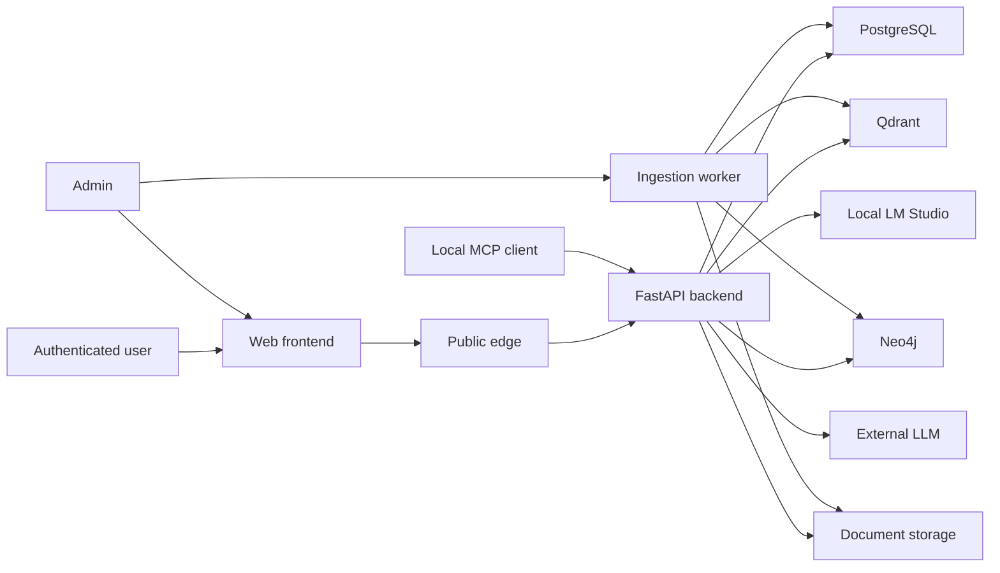

# RAGProject threat model

最終更新: 2026-07-31

## Executive summary

最大のリスクは、認証済み利用者の質問や取得文書に含まれるPII・機密情報を外部LLMへ
意図せず送ること、取得chunk／GraphRAG evidenceの間接prompt injection、将来の
FlashからPlusへの完全自動昇格を悪用したコスト・可用性攻撃である。現状はsession認証、
role、CSRF、upload上限、SSRF対策、Agentic budget、untrusted-context instruction、
trace redactionを持つ。prompt injectionは既定`observe_only`を維持しつつopt-inの
quarantine／direct-block policyと専用security fixtureを追加した。一方、外部生成payloadの
PII masking、`/rag/ask`の共有rate limit／日次budget、corpus provenanceとquarantineは
未実装であり、internet公開前のhigh-priority gapである。

## Scope and assumptions

- In scope:
  - `backend/app/api`
  - `backend/app/core`
  - `backend/app/rag`
  - `backend/app/services`
  - `backend/app/evaluation`
  - `backend/app/mcp`
  - `frontend/src`
  - `deploy/aws-ecs`
- ユーザー確認済み前提:
  - インターネットへ公開するが、RAG利用は認証済みユーザーに限定する。
  - 文書と質問にPIIが含まれ得る。
  - 外部送信は可能な限り避け、必要時も送信前にPIIをmaskする。
  - 将来のFlashからPlusへの昇格は完全自動で行う。
- 仮定:
  - 現時点は単一組織の共有corpusである。multi-tenant化する場合はdocument／chunk単位の
    tenant authorizationを追加するまで公開しない。
  - 公開経路はCloudFrontまたは同等のHTTPS reverse proxyを使用する。
  - LM Studioは同一管理境界内、Alibaba Model Studio等は外部管理境界として扱う。
- Out of scope:
  - OS、Docker Desktop、LM Studio本体、外部provider本体の脆弱性監査。
  - 通常精度profileの昇格判断。security gateと通常精度は別結果として扱う。
  - CI provider自体の詳細監査。
- Open questions:
  - 将来multi-tenantにするか。
  - PIIに要配慮個人情報、決済、医療情報が含まれるか。
  - 外部providerの保存期間、学習利用、data residency契約。

## System model

### Primary components

- React frontend: login、document管理、RAG質問、admin操作。
- FastAPI backend: session認証、CSRF、role判定、RAG orchestration、provider選択。
  Evidence: `backend/app/main.py`, `backend/app/api/deps.py`,
  `backend/app/api/routers/rag.py`.
- Ingestion worker: upload／URL文書の抽出、chunking、embedding、graph抽出。
  Evidence: `backend/app/api/routers/documents.py`,
  `backend/app/services/document_service.py`.
- Data stores: PostgreSQL、Qdrant、Neo4j、upload storage。
- Model boundary: local LM Studioと、設定時のみ外部generation provider。
  Evidence: `backend/app/rag/generation.py`, `backend/app/services/rag_service.py`.
- Security evaluation boundary: synthetic prompt-injection fixtureとraw-free runner。
  Evidence: `backend/app/evaluation/security_gate.py`,
  `backend/app/scripts/run_prompt_injection_security_gate.py`.
- Public deployment: CloudFront、ALB、ECS、RDS、Secrets Manager。
  Evidence: `deploy/aws-ecs/main.tf`, `deploy/aws-ecs/modules/cloudfront/main.tf`.

### Data flows and trust boundaries

- Internet -> CloudFront／frontend:
  - credentials、session cookie、質問、回答がHTTPSを通る。
  - backendはproductionでsecure cookieとstrong session secretを要求する。
- Browser -> FastAPI:
  - JSON、multipart upload、CSRF headerを受ける。
  - session認証、role、CSRF、Pydantic schema、upload byte上限を適用する。
- FastAPI／worker -> PostgreSQL／Qdrant／Neo4j／storage:
  - user、document、chunk、graph、retrieval traceを保存する。
  - アプリnetwork内だが、文書PIIは平文dataとして扱う前提で保護が必要である。
- Store -> generation prompt:
  - retrieved textはuntrusted evidenceとしてsystem instructionと分離する。
  - `RAG_INJECTION_POLICY`既定は観測のみ。opt-in policyは検知chunkを除外できる。
- FastAPI -> LM Studio:
  - user message、選択chunk、system instructionをローカル管理境界内で送る。
- FastAPI -> external LLM:
  - user message、選択chunk、system instruction、provider credentialが境界を越える。
  - 現在、送信前PII maskとserver-side egress policyは未実装である。
- Admin -> URL fetcher:
  - external URLを受け、scheme、credential、DNS、private／metadata IP、redirect、
    content type、sizeを検査する。
- Local MCP client -> MCP HTTP／stdio:
  - read-mostly toolを使う。HTTPはBearer、local-only、write無効をvalidatorが要求する。

#### Diagram

## Assets and security objectives

| Asset | Why it matters | Security objective (C/I/A) |
|---|---|---|
| User questions and chat history | PII、業務情報、意図を含み得る | C/I |
| Uploaded and fetched documents | corpus、PII、知財の原本 | C/I/A |
| Retrieved context and graph | 複数文書由来の情報を集約する | C/I |
| Session／CSRF／provider credentials | account、外部課金、data accessを保護する | C/I |
| Provider routing and cascade policy | 外部送信先、精度、コストを決める | I/A |
| Audit and evaluation evidence | incident調査、昇格判断、公開主張に使う | I/A |
| GPU、LLM quota、worker capacity | RAGの可用性と費用に直結する | A |

## Attacker model

### Capabilities

- 有効なviewer accountを持ち、質問、strategy、許可されたmodel keyを反復送信する。
- 文書やgraph nodeへ混入した間接prompt injectionを質問で誘発する。
- admin accountを奪取した場合、upload、URL ingest、approvalを悪用する。
- 公開login、CSRF token発行、health endpointへ到達する。
- 応答時間、status、安全なreason codeから限定的な挙動を観測する。

### Non-capabilities

- 通常viewerはdocument upload、URL ingest、raw retrieval debug、admin設定を行えない。
- 現在のMCPはremote公開、write tool、evaluation run作成をvalidatorが拒否する。
- attackerがhost、DB、LM Studio、AWS accountへ直接ログインできるとは仮定しない。
- 単一組織前提ではcross-tenant境界はない。multi-tenant化時は再評価する。

## Entry points and attack surfaces

| Surface | How reached | Trust boundary | Notes | Evidence |
|---|---|---|---|---|
| `/api/v1/auth/login` | Internet | Browser -> API | pre-auth CSRF、password、process-local rate limit | `backend/app/api/routers/auth.py`, `backend/app/services/auth_service.py` |
| `/api/v1/rag/ask` | Authenticated viewer | Browser -> API -> model | 質問、strategy、model、取得context | `backend/app/api/routers/rag.py`, `backend/app/services/rag_service.py` |
| Document upload | Admin | Browser -> API -> worker | multipart、Office／PDF／HTML等 | `backend/app/api/routers/documents.py`, `backend/app/services/document_service.py` |
| URL ingest | Admin | API -> Internet | SSRF、redirect、content parser | `backend/app/services/url_fetch_service.py` |
| Retrieved chunks | Approved corpus | Store -> prompt | evidenceとinstructionの境界 | `backend/app/rag/generation.py`, `backend/app/rag/injection_detection.py` |
| External generation | Backend | API -> third party | raw questionとcontextを送信し得る | `backend/app/rag/generation.py` |
| Agentic strategies | Viewer | API -> bounded tools | call／time／result budget | `backend/app/rag/llm_orchestrator.py`, `backend/app/rag/langgraph_agentic.py` |
| MCP HTTP | Local client | Local process -> API | Bearer、local-only、read-mostly | `backend/app/api/routers/mcp.py`, `backend/app/mcp/settings.py` |
| Trace export | Admin or backend | Runtime -> observability | redaction、preview既定off | `backend/app/rag/trace.py`, `backend/app/observability/trace_export.py` |

## Top abuse paths

1. Viewerが外部modelを選ぶ -> backendが質問と取得contextを外部providerへ送る ->
   PIIまたは文書機密が管理境界外へ流出する。
2. 文書中の命令が取得される -> observe-onlyではmodelへ渡る ->
   modelが命令へ追従し、誤答、prompt探索、context再掲を行う。
3. ViewerがFlashで失敗しやすい難問を大量送信 -> cascadeがPlusへ昇格 ->
   provider費用、queue、他ユーザーlatencyを枯渇させる。
4. 悪意あるadmin／sourceがpoisoned documentを登録 -> approval後に高rankで取得 ->
   多数ユーザーへ継続的な誤情報またはinjectionを配布する。
5. 大型／複雑文書や多数jobを投入 -> parser／worker／embeddingを占有 ->
   ingestion backlogとRAG freshnessを悪化させる。
6. multi-tenant化後も共有vector／citation IDだけで認可 -> 他tenant chunkを取得 ->
   cross-tenant disclosureとなる。
7. 将来MCPのlocal-only／read-only制約を緩める -> token漏えいまたは権限過大 ->
   corpus、evaluation、admin操作を自動実行される。

## Threat model table

| Threat ID | Threat source | Prerequisites | Threat action | Impact | Impacted assets | Existing controls (evidence) | Gaps | Recommended mitigations | Detection ideas | Likelihood | Impact severity | Priority |
|---|---|---|---|---|---|---|---|---|---|---|---|---|
| TM-001 | Authenticated viewer | 外部provider有効 | 外部送信を誘発 | PII／知財流出 | 質問、context | auth、CSRF、local LM既定。`rag_service.py` | PII gateとserver allowlistなし | local-first、送信前不可逆mask、低confidence時fail closed、最小evidence | provider別送信、mask件数、blocked egress | high | high | critical |
| TM-002 | Poisoned chunk | chunkが取得される | 間接injectionへ追従 | 誤答、漏えい、policy回避 | 回答、prompt、context | untrusted instruction、pattern reason、opt-in quarantine。`generation.py`, `injection_detection.py` | 既定はobserve-only、semantic／encoded攻撃未対応 | provenance、quarantine、classifier、response DLP、security gate | ASR、poison citation、quarantine、canary | high | high | high |
| TM-003 | Authenticated viewer | 完全自動cascade | hard taskでPlusを強制 | 費用／可用性低下 | quota、GPU | Agentic call／timeout／context budget。`core/config.py` | ask quota、日次cost capなし | per-user RPM、concurrency、1 request 1 escalation、budget、circuit breaker | Plus率、user別token、429、queue | high | high | high |
| TM-004 | Malicious admin／source | ingest権限 | corpus poisonを永続化 | 多数回答のintegrity低下 | corpus、graph、citation | admin-only ingest、audit、SSRF | trust／review／rollback不足 | provenance、two-person review、version quarantine、rollback | source別fail、rank急増、poison hit | medium | high | high |
| TM-005 | Tenant user | 将来multi-tenant | filterを迂回 | cross-tenant leak | corpus、chat | role、chat ownership | document tenant key未確認 | tenant filterをDB/vector/graph/citationで強制 | tenant mismatch deny、canary | low now | high | medium |
| TM-006 | Credential attacker | public login | spray、session abuse | account takeover | session、admin | hash、dummy verify、CSRF、secure-cookie gate | limiterがprocess-local、MFAなし | shared limiter、admin MFA、rotation、revoke、WAF | login velocity、新IP／UA | medium | high | high |
| TM-007 | Malicious admin/content | upload可 | parser／job resource消費 | worker DoS | worker、storage | byte/page/row/time limit、SSRF | queue quota、sandbox／AV不明 | isolated worker、CPU/memory cap、AV/CDR、dedupe | extraction time、OOM、queue depth | medium | medium | medium |
| TM-008 | Operator／external service | exportまたは外部LLM有効 | raw／再識別data送信 | PII leak | trace、questions | TraceRedactor、preview off | generation payloadはtrace policy外 | 統一egress gateway、classification、allowlisted schema、retention contract | egress audit、DLP finding | medium | high | high |
| TM-009 | MCP token holder | remote／write化 | 過大tool権限行使 | data／config変更 | corpus、admin state | local-only、Bearer、write無効。`mcp/settings.py` | 将来のdelegation未設計 | OAuth scope、per-tool authZ、HITL、read/write分離 | caller、scope、arg hash、deny | low now | high | low |

## Criticality calibration

- critical:
  - viewerだけでPIIを外部へ送信できる。
  - pre-auth RCEまたはauth bypassでadmin化できる。
- high:
  - chunk injectionの継続的影響。
  - Plus強制の費用攻撃、admin takeover、corpus poison。
- medium:
  - admin権限を要するparser DoS。
  - 現在は単一tenantだが将来顕在化するIDOR、限定的log leak。
- low:
  - local-only MCPの誤用。
  - 容易に遮断できる高ノイズDoS、低感度metadata leak。

## Focus paths for security review

| Path | Why it matters | Related Threat IDs |
|---|---|---|
| `backend/app/services/rag_service.py` | provider、retrieval、policy、generation境界 | TM-001, TM-002, TM-003 |
| `backend/app/rag/generation.py` | user messageとcontextをprovider payloadへ組み立てる | TM-001, TM-002, TM-008 |
| `backend/app/rag/injection_detection.py` | detect／quarantine／direct-block policy | TM-002, TM-004 |
| `backend/app/evaluation/security_gate.py` | ASR、clean utility、false action契約 | TM-002 |
| `backend/app/api/routers/rag.py` | viewer向け高コストentry point | TM-001, TM-003 |
| `backend/app/core/config.py` | production fail-closedとpolicy設定 | TM-001, TM-003, TM-006 |
| `backend/app/api/deps.py` | sessionとroleの共通認可 | TM-005, TM-006 |
| `backend/app/services/auth_service.py` | login、rate limit、session、audit | TM-006 |
| `backend/app/services/document_service.py` | corpus作成、approval、job | TM-004, TM-007 |
| `backend/app/services/url_fetch_service.py` | SSRF、redirect、DNS、content制限 | TM-007 |
| `backend/app/rag/llm_orchestrator.py` | Agentic tool／time／result budget | TM-002, TM-003 |
| `backend/app/rag/trace.py` | debug情報のredaction | TM-008 |
| `backend/app/mcp/settings.py` | local-only／read-only制約 | TM-009 |
| `deploy/aws-ecs/modules/cloudfront/main.tf` | public HTTPS edge | TM-003, TM-006 |
| `deploy/aws-ecs/modules/network/main.tf` | service／store network境界 | TM-005, TM-008 |

## Quality check

- public、authenticated、admin、model、storage、external、MCP entry pointを含めた。
- 各trust boundaryを少なくとも1つのthreatへ対応付けた。
- production runtime、local security evaluation、MCP、CI／devを区別した。
- internet exposure、認証、PII、外部送信回避、完全自動cascadeの確認済み前提を反映した。
- multi-tenancy、PII分類、external-provider契約をopen questionとして残した。
